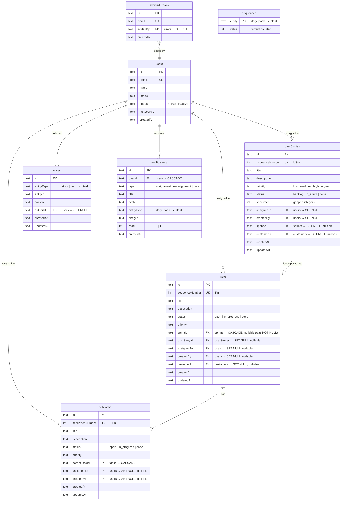
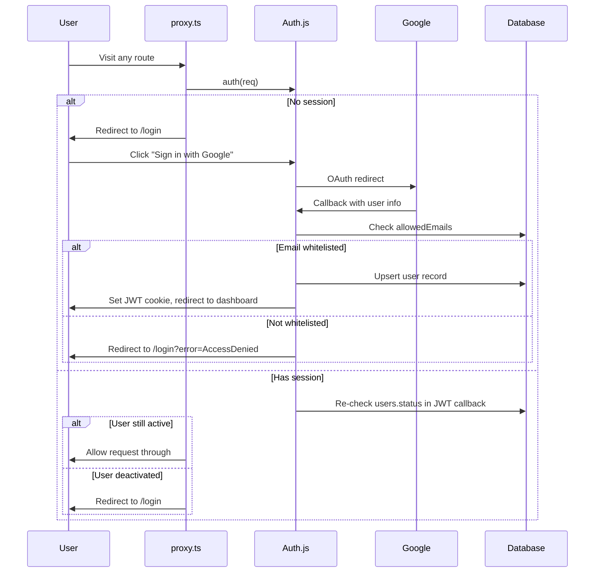
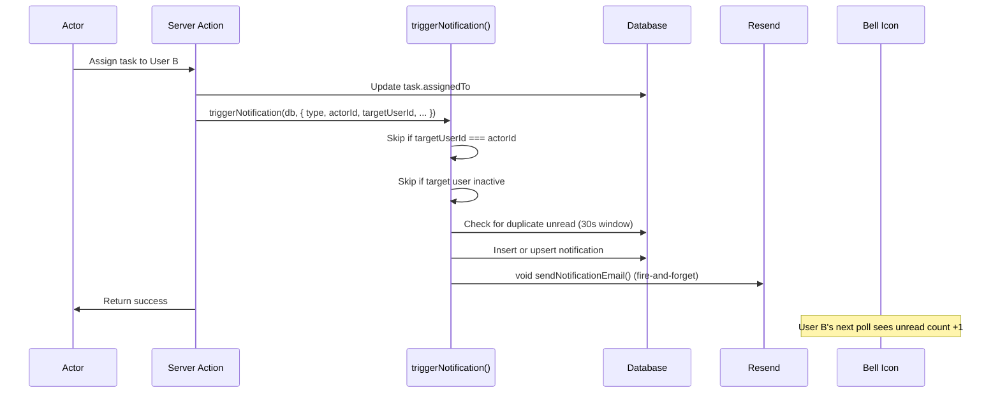

# Multi-User Sprint Tracker

## Enhancement Summary

**Deepened on:** 2026-03-31
**Sections enhanced:** All units, key decisions, system-wide impact, risks
**Review agents used:** Security Sentinel, Architecture Strategist, Performance Oracle, Data Integrity Guardian, TypeScript Reviewer, Pattern Recognition Specialist, Frontend Races Reviewer
**Research agents used:** Auth.js v5 docs, Resend + React Email, @dnd-kit/react v0.3

### Key Improvements from Deepening

1. **Server-side auth in every API route** — `requireAuth()` helper; proxy.ts is optimistic only, not a security boundary
2. **Atomic sequential ID generation** — dedicated `sequences` table with `UPDATE...RETURNING` instead of race-prone `MAX+1`
3. **Explicit `onDelete` behaviour for all 9 new FKs** — cascade, set-null, or restrict per relationship
4. **Application-level cascade for polymorphic tables** — delete actions must clean up notes/notifications
5. **Composite indexes** on all polymorphic and filtered query patterns
6. **JWT callback re-checks user status** on every request for immediate revocation
7. **Auth context injection** — `userId` parameter added to all mutation actions
8. **Discriminated union `ActionResult<T>`** — replaces loose `{ success, errors? }` pattern
9. **Shared types** — `EntityType` union, centralised `DB` type, NextAuth module augmentation
10. **`triggerNotification()` helper** — extracts cross-cutting notification logic from 6+ action files
11. **Gapped integer sort order** for backlog reordering (1 update per drag, not N)
12. **Frontend race protection** — optimistic rollback, poll generation tokens, server-derived edit window
13. **`moveStoryToSprint` is pessimistic** — wait for server confirmation before removing from backlog
14. **Notification deduplication** — upsert within time window to prevent spam on rapid reassignment
15. **Whitelist safety guards** — prevent self-removal and last-user removal

### New Considerations Discovered

- SQLite `ALTER COLUMN` is not supported — making `sprintId` nullable requires table recreation in migration. Must verify `taskTags` FK references survive.
- Resend rate limit is 2 req/s. Use `void sendNotificationEmail()` (non-awaited) for true fire-and-forget.
- dnd-kit React v0.3 single-list sorting is much simpler than kanban — only needs `onDragEnd` (not `onDragOver`), no `group`/`useDroppable`.
- Existing kanban board mutates state inside `setItems` (`found.status = status`) — should be fixed to produce new objects before replicating pattern.

---

## Overview

Transform the single-user sprint tracker into a multi-user collaborative tool. Adds Google OAuth authentication (whitelist-only), a backlog of user stories that decompose into tasks with sub-tasks, task assignment with email and in-app notifications, notes/comments, and human-readable sequential IDs.

## Problem Frame

The sprint tracker currently has no concept of users, authentication, or collaboration. Two distinct users (with different customers and workflows) need to share the system while seeing relevant work. The app also lacks a backlog for pre-sprint planning and has no way to break work into hierarchical units (stories → tasks → sub-tasks). (see origin: docs/brainstorms/2026-03-30-multi-user-sprint-tracker-requirements.md)

## Requirements Trace

- R1. Google OAuth sign-in (NextAuth v5 / Auth.js, JWT strategy)
- R2. Whitelist-only access — admin manages allowed users
- R3. All app routes require authentication; unauthenticated users redirect to login
- R4–R6. Sequential short IDs: `US-n`, `T-n`, `ST-n`
- R7. Short IDs displayed on all entity cards, lists, and detail views
- R8. Running totals in section headers (e.g. "Backlog (12 stories)")
- R9. "Backlog" menu item above "Sprints" in sidebar
- R10. Single global backlog — ordered list of user stories with filtering by assignee/customer
- R11. User story entity: title, description, priority, assignee, short ID, sort order
- R12. Drag-and-drop reordering of stories in the backlog
- R13. Stories decompose into multiple tasks linked to the story
- R14. Moving a story to a sprint assigns its tasks to that sprint; story status changes to `in_sprint`
- R15. Tasks assignable to any user in the system
- R16. Assignment/reassignment triggers email (Resend) + in-app notification
- R17. User stories also assignable
- R18–R20. Notes/comments on tasks and stories, newest-first, with author + timestamp
- R21. Reassignment supported from detail/notes view
- R22. Sub-tasks nested within parent tasks
- R23. Sub-tasks have title, description, status, priority, assignee, short ID, notes
- R24. New sub-tasks default to parent task's assignee
- R25. Sub-task reassignment triggers notification
- R26. Sub-tasks movable between parent tasks (keep current assignee)
- R27. Bell icon with unread count in header, per-user
- R28. Notification triggers: assignment, reassignment, new notes on your tasks
- R29. Mark read individually or all-at-once

## Scope Boundaries

- No role-based permissions beyond admin whitelist management
- No real-time collaboration (websockets) — standard request/response
- No Slack or third-party notification integrations
- ClickUp sync not extended to new entities
- No file attachments or @mentions on notes
- Notes editable by author within 5 minutes, then read-only
- Removed users: access revoked immediately, assignments left intact, displayed as inactive
- Single global backlog with filtering (not per-user or per-folder)

## Context & Research

### Relevant Code and Patterns

- **Schema**: `src/lib/db/schema.ts` — Drizzle + SQLite tables, text UUID PKs, ISO timestamp strings, `.$defaultFn(() => new Date().toISOString())` for timestamps, `uuid()` from `uuid` package for IDs, snake_case SQL column names mapped to camelCase JS (`text("sprint_id")` → `sprintId`)
- **Server actions**: `src/lib/actions/*.ts` — `"use server"` directive on line 1, `db: DB` as first param (where `type DB = LibSQLDatabase<any>` is declared per-file), return `{ success, entity?, errors? }`. Zod error-parsing block is duplicated across every action file.
- **API routes**: `src/app/api/` — bridge to server actions, `params` is `Promise<{ id: string }>` (Next.js 16), import `NextResponse` from `next/server`, import `db` from `@/lib/db`, return `NextResponse.json(result)`. Currently have zero auth checks.
- **Kanban drag-drop**: `src/components/features/kanban-board.tsx` — `@dnd-kit/react` v0.3 with `DragDropProvider`, `useSortable`, `useDroppable`. Note: line 291 mutates state (`found.status = status`) — should produce new objects instead.
- **Form dialogues**: `src/components/features/task-form.tsx` — controlled Dialogue (shadcn v4 + Base UI, NOT Radix), Zod v4 validation imported as `zod/v4`, inline error display
- **Sidebar**: `src/app/(dashboard)/layout.tsx` — server-rendered nav, folders as `<details>`, mobile drawer, `export const dynamic = "force-dynamic"` on line 1
- **Validators**: `src/lib/validators/` — Zod v4 imported as `zod/v4`, singular file naming (`task.ts`, `sprint.ts`)
- **Sort order pattern**: `folders.sortOrder` — integer column, used for ordering
- **Reference OAuth project**: `/Users/gilesparnell/Documents/VSStudio/parnell-systems/parnellsystems-platform` — NextAuth v5, Google provider, JWT, admin whitelist, `auth.ts` + callbacks. Uses Prisma; we adapt for Drizzle + LibSQL.

### External References

- **Next.js 16 proxy**: `middleware.ts` renamed to `proxy.ts`; export `proxy` function, Node.js runtime only (Edge NOT supported). See `node_modules/next/dist/docs/01-app/01-getting-started/16-proxy.md`. Config flag renamed: `skipMiddlewareUrlNormalize` → `skipProxyUrlNormalize`.
- **Next.js 16 auth guide**: `node_modules/next/dist/docs/01-app/02-guides/authentication.md` — recommends proxy for optimistic auth checks only, server actions for mutations. Proxy is NOT a security boundary.
- **Auth.js v5**: env vars `AUTH_GOOGLE_ID`, `AUTH_GOOGLE_SECRET`, `AUTH_SECRET` (auto-detected names). `auth.config.ts` is for edge/proxy runtime (lightweight, no DB access); `auth.ts` is for Node.js runtime (full callbacks with DB queries). Two-file split is intentional.
- **Resend**: `resend.emails.send()` returns `{ data, error }` — does NOT throw. Rate limit: 2 req/s. Batch: up to 100 emails per call. `react:` prop accepts React Email components. `PreviewProps` static property enables dev preview. Use `onboarding@resend.dev` as `from` for dev sandbox.
- **Drizzle SQLite**: `autoIncrement` only on PKs. Use a dedicated `sequences` table with atomic `UPDATE...RETURNING` for sequential IDs. `db.transaction()` supported by LibSQL driver.
- **dnd-kit React v0.3 single-list**: Only needs `onDragEnd` (not `onDragOver`). No `group`, `useDroppable`, or `move` helper needed. `useSortable({ id, index })` — simpler than kanban multi-column. `structuredClone` snapshot pattern for optimistic rollback on API failure.

## Key Technical Decisions

- **`proxy.ts` not `middleware.ts`**: Next.js 16 breaking change. Auth route protection uses `proxy.ts` exporting `proxy` function. This is an optimistic redirect only — every API route and server action must ALSO verify auth server-side.
- **JWT strategy, no DB adapter**: Session lives in cookie/token. No session table needed. Whitelist checked in `signIn` callback. JWT callback re-checks `users.status` on every request to enable immediate revocation of deactivated users.
- **`sprintId` becomes nullable**: Tasks created from backlog stories have `sprintId = null` until moved to a sprint. SQLite requires table recreation for this change — migration must be verified carefully.
- **User story statuses**: `backlog` → `in_sprint` → `done`. Moving to sprint changes status; moving back allowed.
- **Atomic sequential ID generation via `sequences` table**: A dedicated `sequences` table with rows per entity type (`story`, `task`, `subtask`). Use `UPDATE sequences SET value = value + 1 WHERE entity = ? RETURNING value` — atomic in a single statement, no read-then-write gap, no race conditions. Add UNIQUE constraint on `sequenceNumber` per entity table as a safety net.
- **Polymorphic comments table**: Single `notes` table with `entityType` + `entityId` columns to serve stories, tasks, and sub-tasks. Use Drizzle's `text("entity_type", { enum: ["story", "task", "subtask"] })` for type safety. Application-level cascade cleanup on entity deletion.
- **Polymorphic notifications table**: Single `notifications` table with `entityType` + `entityId` for all notification types. Same enum pattern. Polling at 30-second intervals on the client with generation tokens to prevent stale-data flicker.
- **Email is fire-and-forget**: Use `void sendNotificationEmail(...)` (non-awaited promise) so Resend latency never blocks the triggering action. Failures logged but don't block.
- **Gapped integer sort order for backlog**: Assign initial sort orders with gaps (1000, 2000, 3000...). On reorder, set moved item to midpoint between neighbours. Only re-index when gaps exhausted. Reduces common case from N updates to 1 update per drag.
- **Auth context injection**: All mutation server actions take `userId: string` as a parameter (after `db`). API routes extract `userId` from `auth()` session and pass it through. Read-only actions that are not user-scoped remain unchanged.
- **Discriminated union action results**: New pattern `ActionResult<T> = { success: true; data: T } | { success: false; errors: Record<string, string[]> }`. Eliminates non-null assertions on result entities. Defined once in a shared types file.
- **Centralised `triggerNotification()` helper**: Handles both in-app notification insert and fire-and-forget email despatch. Called from mutation actions instead of duplicating logic across 6+ files.
- **`moveStoryToSprint` is pessimistic**: Show loading state on the story card; only remove from backlog view after server confirms success. The blast radius of partial failure (story in `in_sprint` but tasks without `sprintId`) is too high for optimistic UI.

## Open Questions

### Resolved During Planning

- **proxy.ts vs middleware.ts**: Next.js 16 uses `proxy.ts`. Confirmed via local docs
- **NextAuth v5 compatibility with Next.js 16**: Auth.js docs already show the proxy pattern. Use latest `next-auth` release
- **Sequential ID generation in SQLite**: Dedicated `sequences` table with atomic UPDATE...RETURNING. UNIQUE constraint as safety net.
- **Single vs multiple backlogs**: Single global backlog with filtering by assignee and customer
- **Story status lifecycle**: `backlog` / `in_sprint` / `done`
- **Sub-task assignee on parent move**: Keep current assignee; default inheritance only at creation time
- **Note editability**: Author can edit within 5 minutes of creation, then immutable. Server returns `editableUntil` timestamp; client derives countdown from that (never trust client clock).
- **Notification polling strategy**: 30-second interval from bell component. Use `pollGeneration` counter to discard stale responses. Optimistic local state for mark-as-read.
- **onDelete behaviour for all FKs**: See table in Implementation Conventions section below.

### Deferred to Implementation

- **Exact session duration and refresh UX**: Use NextAuth defaults initially; tune if users report issues. Consider 24-hour maxAge for an internal tool.
- **Optimistic concurrency**: Last-write-wins for now; add `updatedAt` checking if conflicts reported
- **Admin whitelist UI placement**: Settings page tab vs dedicated page — decide when building the settings UI
- **Turso batch transaction mode**: Verify `db.transaction()` in the Drizzle LibSQL driver uses IMMEDIATE mode for write serialisation. If using remote HTTP driver, may need batch API.
- **Notification retention**: Consider auto-deleting read notifications older than 90 days to bound table growth.

## Implementation Conventions

> *These conventions apply across all implementation units. The implementing agent should follow them consistently without needing per-unit reminders.*

### Foreign Key onDelete Behaviour

| FK Column | Parent Table | `onDelete` |
|---|---|---|
| `tasks.userStoryId` | `userStories` | `SET NULL` (tasks survive story deletion) |
| `tasks.assignedTo` | `users` | `SET NULL` |
| `tasks.createdBy` | `users` | `SET NULL` |
| `subTasks.parentTaskId` | `tasks` | `CASCADE` (subtasks die with parent) |
| `subTasks.assignedTo` | `users` | `SET NULL` |
| `userStories.assignedTo` | `users` | `SET NULL` |
| `userStories.createdBy` | `users` | `SET NULL` |
| `notes.authorId` | `users` | `SET NULL` (preserve notes, show "deleted user") |
| `notifications.userId` | `users` | `CASCADE` (no point keeping notifications for removed users) |
| `allowedEmails.addedBy` | `users` | `SET NULL` |

### Required Database Indexes

```sql
-- Notes: fetch all notes for an entity
CREATE INDEX idx_notes_entity ON notes(entity_type, entity_id, created_at);

-- Notifications: unread count per user (most frequent query)
CREATE INDEX idx_notifications_user_unread ON notifications(user_id, read);

-- Notifications: navigate to entity from notification
CREATE INDEX idx_notifications_entity ON notifications(entity_type, entity_id);

-- User stories: backlog listing (filtered and sorted)
CREATE INDEX idx_stories_status_sort ON user_stories(status, sort_order);

-- User stories: filter by assignee
CREATE INDEX idx_stories_assignee ON user_stories(assigned_to, status);

-- Tasks: fetch by story
CREATE INDEX idx_tasks_story ON tasks(user_story_id);

-- Sub-tasks: fetch by parent task
CREATE INDEX idx_subtasks_parent ON sub_tasks(parent_task_id);
```

### Schema Conventions

- All new tables: `text("id").primaryKey()` with `uuid()` from `uuid` package
- All timestamps: `text("created_at").$defaultFn(() => new Date().toISOString())`
- All SQL columns: snake_case (e.g. `entity_type`, `assigned_to`, `parent_task_id`)
- All JS fields: camelCase (mapped by Drizzle)
- Every action file: `"use server"` directive on line 1
- Shared `DB` type: export from `src/lib/db/types.ts` instead of per-file redeclaration
- Use Drizzle's `text("column", { enum: [...] })` for all enum columns

### Type System Conventions

- **`EntityType`** union: `"story" | "task" | "subtask"` — defined once in `src/lib/types.ts`, used in schema, validators, and actions
- **`ActionResult<T>`**: discriminated union defined in `src/lib/types.ts`:
  ```
  { success: true; data: T } | { success: false; errors: Record<string, string[]> }
  ```
- **NextAuth module augmentation**: `src/types/next-auth.d.ts` extending `Session.user` with `id: string` and `status: string`
- **Composite query types**: `StoryWithTasks`, `TaskWithSubtasks` defined alongside their action files
- **`$inferSelect` / `$inferInsert`** types exported for every new table
- **`formatDisplayId(entityType, seqNumber)`**: typed with `EntityType` param, returns `"US-5"` / `"T-12"` / `"ST-3"`
- **Zod shared enums**: Extract `priorityEnum`, `entityTypeEnum` to `src/lib/validators/shared.ts`
- **Zod error-parsing helper**: Extract the duplicated error-parsing block to a shared `parseZodErrors(error)` utility

### API Route Auth Pattern

Every API route handler must:
1. Call `auth()` from `@/lib/auth` to verify the session server-side
2. Return 401 if no valid session
3. Extract `userId` from session and pass to the action
4. Parse request body through a Zod schema (never destructure raw `request.json()`)

Create a shared `requireAuth()` helper that wraps this pattern. Also retrofit all existing API routes (tasks, folders, sprints, customers, tags) with this check.

### Notification Pattern

Extract a `triggerNotification(db, { type, actorId, targetUserId, entityType, entityId, title })` helper in `src/lib/helpers/notify.ts` that:
1. Skips if `targetUserId === actorId` (don't notify yourself)
2. Skips if target user status is `inactive`
3. Checks for duplicate unread notification for same `(userId, entityType, entityId, type)` within last 30 seconds — upsert instead of creating new
4. Inserts the notification row
5. Calls `void sendNotificationEmail(...)` (non-awaited) for fire-and-forget email

### New Server Pages

All new server component pages (`backlog/page.tsx`, `tasks/[id]/page.tsx`, `stories/[id]/page.tsx`) must include `export const dynamic = "force-dynamic"` to match the existing dashboard layout pattern.

## High-Level Technical Design

> *This illustrates the intended approach and is directional guidance for review, not implementation specification. The implementing agent should treat it as context, not code to reproduce.*

### Entity Relationship Diagram



### Auth Flow



### Notification Flow



## Implementation Units

### Phase 0: Preparatory Refactors

- [ ] **Unit 0: Shared Types, Auth Helper, and DB Type Centralisation**

  **Goal:** Extract shared infrastructure that all subsequent units depend on. Retrofit existing API routes with auth guards.

  **Requirements:** R3 (auth enforcement)

  **Dependencies:** None

  **Files:**
  - Create: `src/lib/types.ts` — `EntityType`, `ActionResult<T>`, `formatDisplayId()`
  - Create: `src/lib/db/types.ts` — shared `DB` type export
  - Create: `src/lib/validators/shared.ts` — shared Zod enums (`priorityEnum`, `entityTypeEnum`, `statusEnum`)
  - Create: `src/lib/helpers/zod-errors.ts` — extracted Zod error-parsing utility
  - Create: `src/types/next-auth.d.ts` — NextAuth module augmentation (placeholder until Unit 2)
  - Modify: existing action files — replace per-file `DB` type with shared import
  - Modify: existing action files — replace duplicated error-parsing with shared helper

  **Approach:**
  - Define `EntityType = "story" | "task" | "subtask"` as the shared union
  - Define `ActionResult<T>` discriminated union
  - Define `formatDisplayId(entityType: EntityType, seq: number): string` mapping story→US, task→T, subtask→ST
  - Export `DB` type from one location; update all existing action file imports
  - Extract the Zod `fieldErrors` parsing block into a reusable function
  - Create shared Zod enums for priority, entity type — reusable across all validators

  **Patterns to follow:**
  - Existing action file signatures for the refactor
  - Keep changes minimal — this is infrastructure, not features

  **Test scenarios:**
  - `formatDisplayId("story", 5)` → `"US-5"`
  - `formatDisplayId("task", 12)` → `"T-12"`
  - `ActionResult` type narrows correctly (success: true → data available, success: false → errors available)
  - Existing tests still pass after DB type centralisation

  **Verification:**
  - All existing tests pass
  - No per-file `type DB = LibSQLDatabase<any>` remaining in action files
  - No duplicated Zod error-parsing blocks

### Phase 1: Authentication & Users

- [ ] **Unit 1: Database Schema — Users, Whitelist, and Sequences**

  **Goal:** Add `users`, `allowedEmails`, and `sequences` tables. Make `tasks.sprintId` nullable. Add `assignedTo` and `createdBy` columns to tasks.

  **Requirements:** R1, R2, R15

  **Dependencies:** Unit 0

  **Files:**
  - Modify: `src/lib/db/schema.ts`
  - Create: `src/lib/actions/users.ts`
  - Create: `src/lib/helpers/sequence.ts`
  - Test: `src/__tests__/actions/users.test.ts`

  **Approach:**
  - Add `users` table with `id`, `email` (unique), `name`, `image`, `status` (active/inactive), `lastLoginAt`, `createdAt`
  - Add `allowedEmails` table with `id`, `email` (unique), `addedBy` (FK to users, onDelete SET NULL), `createdAt`
  - Add `sequences` table with `entity` (text PK — "story", "task", "subtask") and `value` (integer, default 0)
  - Alter `tasks.sprintId` to be nullable — **IMPORTANT**: SQLite does not support ALTER COLUMN. This requires table recreation (copy to temp, drop, recreate, copy back). Verify the generated migration SQL preserves `taskTags` FK references. Test on a copy of production data.
  - Add `assignedTo` text column (FK to users, onDelete SET NULL, nullable) on tasks
  - Add `createdBy` text column (FK to users, onDelete SET NULL, nullable) on tasks
  - Create `getNextSequenceNumber(db, entityType)` helper using atomic `UPDATE sequences SET value = value + 1 WHERE entity = ? RETURNING value`
  - Create user CRUD actions with `userId` param on mutations
  - Seed the sequences table with initial rows and the whitelist with initial users in migration
  - Add UNIQUE constraint on `sequenceNumber` per entity table as safety net
  - Run `pnpm db:generate` and carefully review generated SQL
  - Audit all existing queries referencing `tasks.sprintId` for null-safety (type changes from `string` to `string | null`)

  **Patterns to follow:**
  - `src/lib/db/schema.ts` — existing table definitions, snake_case SQL columns
  - `src/lib/actions/tasks.ts` — action function signatures (now using shared `DB` type and `ActionResult<T>`)

  **Test scenarios:**
  - Create user, verify fields
  - Add email to whitelist, check for duplicates
  - Check email against whitelist (exists vs doesn't exist)
  - `getNextSequenceNumber("task")` returns 1, then 2, then 3 on successive calls
  - Verify existing tasks still work with nullable sprintId
  - Verify `taskTags` FK references survive migration

  **Verification:**
  - Migration applies cleanly on fresh DB and on copy of production data
  - Existing task queries still function
  - Sequential IDs generate correctly without duplicates

- [ ] **Unit 2: Auth.js Configuration and Google OAuth**

  **Goal:** Set up NextAuth v5 with Google provider, JWT strategy, whitelist-checking sign-in callback, and user status re-check on every request.

  **Requirements:** R1, R2

  **Dependencies:** Unit 1

  **Files:**
  - Create: `src/lib/auth.ts` — full auth config with DB-accessing callbacks (Node.js runtime)
  - Create: `src/lib/auth.config.ts` — base config for proxy runtime (no DB access)
  - Create: `src/lib/auth-helpers.ts` — `requireAuth()` helper for API routes
  - Create: `src/app/api/auth/[...nextauth]/route.ts`
  - Modify: `src/types/next-auth.d.ts` — fill in module augmentation
  - Modify: `.env.local.example`

  **Approach:**
  - Follow reference project pattern (`parnellsystems-platform/src/lib/auth.ts`) but adapt for Drizzle + LibSQL
  - `auth.config.ts`: session strategy JWT, pages config, route-matching logic. This file runs in proxy runtime — no DB imports.
  - `auth.ts`: imports config, adds Google provider with `prompt: "select_account"`, defines callbacks:
    - `signIn` callback: check email against `allowedEmails` table; if not found, return `/login?error=AccessDenied`. Upsert user record (create if first time, update `lastLoginAt` if returning).
    - `jwt` callback: on every request, re-check `users.status` — if inactive, return empty token to force re-auth. Enrich token with user `id` and `status`.
    - `session` callback: expose `id` and `status` on `session.user`
  - `requireAuth()` helper: calls `auth()`, returns 401 if no session, returns typed `{ userId, session }`. Used by all API routes.
  - Module augmentation in `src/types/next-auth.d.ts`: extend `Session.user` with `id: string`, `status: string`
  - Env vars: `AUTH_SECRET`, `AUTH_GOOGLE_ID`, `AUTH_GOOGLE_SECRET`
  - Retrofit ALL existing API routes with `requireAuth()` at the top of each handler

  **Patterns to follow:**
  - Reference project: `parnellsystems-platform/src/lib/auth.ts` and `auth.config.ts`

  **Test scenarios:**
  - Whitelisted email signs in → user record created/updated, session returned with `id` and `status`
  - Non-whitelisted email → sign-in rejected
  - Returning user → `lastLoginAt` updated
  - Deactivated user's JWT callback returns empty token → forces re-auth
  - `requireAuth()` returns 401 for missing/invalid session
  - Existing API routes now reject unauthenticated requests

  **Verification:**
  - Google OAuth flow completes end-to-end in dev
  - Non-whitelisted emails see access denied
  - Deactivated users are locked out within one request
  - All existing API routes return 401 without valid session

- [ ] **Unit 3: Route Protection with proxy.ts**

  **Goal:** Protect all dashboard routes; redirect unauthenticated users to login page.

  **Requirements:** R3

  **Dependencies:** Unit 2

  **Files:**
  - Create: `src/proxy.ts` (or project root — check Next.js 16 convention for `src/` projects)
  - Create: `src/app/login/page.tsx`
  - Modify: `src/app/layout.tsx` — wrap children (not layout itself) with SessionProvider

  **Approach:**
  - `proxy.ts` exports `proxy` function (NOT `middleware`) per Next.js 16
  - Use `auth()` from Auth.js config to check session; redirect to `/login` if missing
  - Matcher excludes `/api/auth`, `/_next/static`, `/_next/image`, `/favicon.ico`, `/login`
  - Login page: simple card with "Sign in with Google" button using server action calling `signIn('google')`
  - Handle `?error=AccessDenied` query param with user-friendly message
  - `SessionProvider` wraps only `{children}` in root layout — server components use `auth()` directly, not `useSession()`

  **Patterns to follow:**
  - Next.js 16 proxy docs: `node_modules/next/dist/docs/01-app/01-getting-started/16-proxy.md`
  - Reference project login page

  **Test scenarios:**
  - Unauthenticated user visiting `/sprints` → redirected to `/login`
  - Authenticated user visiting `/sprints` → allowed through
  - Login page renders with Google sign-in button
  - Access denied error displayed when non-whitelisted email attempts sign-in
  - Direct API calls without session still rejected (by `requireAuth()`, not proxy)

  **Verification:**
  - All dashboard routes are protected
  - Login flow works end-to-end
  - Existing pages render correctly when authenticated

- [ ] **Unit 4: User Context in Layout and Header**

  **Goal:** Display current user in the header; add user avatar and sign-out functionality.

  **Requirements:** R1, R3

  **Dependencies:** Unit 3

  **Files:**
  - Modify: `src/app/(dashboard)/layout.tsx`
  - Create: `src/components/features/user-menu.tsx`

  **Approach:**
  - Add user avatar + name in header area of dashboard layout
  - Dropdown menu with "Sign out" option
  - Use `auth()` server-side in layout to get session (NOT `useSession()`)
  - Client component for the dropdown interaction only
  - Sign out calls `signOut({ callbackUrl: '/login' })`

  **Patterns to follow:**
  - Reference project: `UserAvatar.tsx`, `SignOutButton.tsx`
  - Existing sidebar styling (dark theme, green accents)

  **Test scenarios:**
  - Authenticated user sees their name and avatar
  - Sign out redirects to login page
  - Google profile image displays correctly (fallback to initials if no image)

  **Verification:**
  - User info displays correctly in header
  - Sign out works

### Phase 2: Sequential IDs and Schema Extensions

- [ ] **Unit 5: User Stories and Sub-Tasks Schema**

  **Goal:** Create the user stories and sub-tasks tables with sequential IDs, and add `sequenceNumber` to existing tasks. Backfill existing tasks.

  **Requirements:** R4–R7, R11, R22–R23

  **Dependencies:** Unit 1

  **Files:**
  - Modify: `src/lib/db/schema.ts`
  - Test: `src/__tests__/helpers/sequence.test.ts`

  **Approach:**
  - Add `sequenceNumber` integer column (NOT NULL, UNIQUE) to `tasks` table
  - Create `userStories` table: `id`, `sequenceNumber` (NOT NULL, UNIQUE), `title`, `description`, `priority`, `status` (backlog/in_sprint/done), `sortOrder`, `assignedTo`, `createdBy`, `sprintId` (nullable), `customerId` (nullable), timestamps
  - Create `subTasks` table: `id`, `sequenceNumber` (NOT NULL, UNIQUE), `title`, `description`, `status`, `priority`, `parentTaskId` (FK to tasks, onDelete CASCADE), `assignedTo` (nullable), `createdBy` (nullable), timestamps
  - Add all indexes from the Implementation Conventions section
  - Backfill existing tasks with sequence numbers ordered by `createdAt` ASC using a CTE with `ROW_NUMBER()` — verify SQLite/LibSQL supports this syntax
  - Update `sequences` table value for `task` to match the max backfilled number
  - **Consider combining this migration with Unit 1** to avoid two sequential table recreations on `tasks`. If they deploy together, a single migration is safer.
  - Run `pnpm db:generate` and review

  **Patterns to follow:**
  - Existing schema column definitions with `$defaultFn` for timestamps
  - `folders.sortOrder` for the integer ordering pattern

  **Test scenarios:**
  - `getNextSequenceNumber("story")` returns 1 for fresh sequences row
  - `getNextSequenceNumber("task")` returns max+1 after backfill
  - Backfilled tasks have contiguous sequence numbers
  - `formatDisplayId("story", 5)` → `"US-5"`
  - UNIQUE constraint prevents duplicate sequence numbers

  **Verification:**
  - Migration applies cleanly
  - Existing tasks get backfilled sequence numbers in createdAt order
  - New stories, tasks, and sub-tasks get correct sequential IDs
  - All indexes are created

- [ ] **Unit 6: Notes Table and Actions**

  **Goal:** Create polymorphic notes table for comments on stories, tasks, and sub-tasks.

  **Requirements:** R18–R20

  **Dependencies:** Unit 5

  **Files:**
  - Modify: `src/lib/db/schema.ts`
  - Create: `src/lib/actions/notes.ts`
  - Create: `src/lib/validators/note.ts`
  - Create: `src/app/api/notes/route.ts`
  - Create: `src/app/api/notes/[id]/route.ts`
  - Test: `src/__tests__/actions/notes.test.ts`

  **Approach:**
  - `notes` table: `id`, `entityType` (text with enum constraint: story/task/subtask), `entityId`, `content`, `authorId` (FK to users, onDelete SET NULL), `createdAt`, `updatedAt`
  - Add `idx_notes_entity` composite index
  - Actions (all take `db, userId` params):
    - `createNote`: validates entity exists for given entityType before inserting. Sets `authorId` and `createdAt` server-side (never from client). Triggers notification to entity assignee if different from author.
    - `updateNote`: fetches existing note, verifies `authorId === userId` AND `createdAt` is within 5 minutes of server time. Only `content` field is updateable — Zod schema for updates excludes all other fields.
    - `getNotesForEntity`: ordered by `createdAt DESC`. Returns `editableUntil` (createdAt + 5 min) for each note so client can derive countdown without trusting its own clock.
  - Zod validators: `createNoteSchema` (content, entityType, entityId) and `updateNoteSchema` (content only)
  - API routes use `requireAuth()` and parse body through Zod

  **Patterns to follow:**
  - `src/lib/actions/tasks.ts` — action structure with shared `ActionResult<T>`
  - `src/lib/validators/task.ts` — Zod v4 validation with shared enums

  **Test scenarios:**
  - Create note on task, verify author and timestamp set server-side
  - Edit note within 5 minutes → succeeds
  - Edit note after 5 minutes → fails with error
  - Edit note by different user → fails
  - Attempt to change `authorId` or `entityType` via update → rejected by Zod schema
  - Get notes returns newest-first with `editableUntil` field
  - Create note on non-existent entity → fails with error

  **Verification:**
  - Notes CRUD works for all entity types
  - Edit window is enforced server-side
  - Entity existence is validated before insert

- [ ] **Unit 7: Notifications Table and In-App Bell**

  **Goal:** Create notifications infrastructure, `triggerNotification()` helper, and bell icon UI with polling.

  **Requirements:** R27–R29

  **Dependencies:** Unit 1, Unit 4

  **Files:**
  - Modify: `src/lib/db/schema.ts`
  - Create: `src/lib/actions/notifications.ts`
  - Create: `src/lib/helpers/notify.ts` — `triggerNotification()` helper
  - Create: `src/components/features/notification-bell.tsx`
  - Create: `src/app/api/notifications/route.ts`
  - Create: `src/app/api/notifications/[id]/read/route.ts`
  - Create: `src/app/api/notifications/read-all/route.ts`
  - Modify: `src/app/(dashboard)/layout.tsx`
  - Test: `src/__tests__/actions/notifications.test.ts`

  **Approach:**
  - `notifications` table: `id`, `userId` (FK to users, onDelete CASCADE), `type` (assignment/reassignment/note), `title`, `body`, `entityType`, `entityId`, `read` (integer 0/1), `createdAt`
  - Add `idx_notifications_user_unread` and `idx_notifications_entity` indexes
  - Actions: `createNotification`, `getUnreadCount`, `getNotificationsForUser`, `markAsRead` (verifies `notification.userId === session.userId`), `markAllAsRead` (scoped to session userId)
  - `triggerNotification()` helper in `src/lib/helpers/notify.ts` — see Implementation Conventions section for full logic
  - API routes: all use `requireAuth()`. Notification queries derive `userId` from server session, NEVER from request params.
  - Bell icon component:
    - Polls every 30 seconds via `setInterval` in `useEffect` (with cleanup on unmount)
    - Uses `pollGeneration` ref: incremented on any user action (mark-as-read); stale poll responses discarded
    - Optimistic local state for mark-as-read: decrement badge count immediately, let next poll confirm
    - "Mark all as read" also uses optimistic state
    - Shows unread count badge, opens dropdown with notification list
    - Clicking a notification navigates to the entity and marks as read
  - Place bell icon in dashboard header next to user menu
  - Handle gracefully when linked entity has been deleted (show "This item has been deleted")

  **Patterns to follow:**
  - Existing API route pattern (params as Promise, `requireAuth()`)
  - Badge styling from existing priority/status badges

  **Test scenarios:**
  - Create notification, verify it appears in user's unread count
  - Mark individual notification as read → count decreases
  - Mark all as read → count goes to zero
  - Notifications for other users not visible
  - `markAsRead` rejects if notification belongs to different user
  - Duplicate notification within 30s window → upserted, not duplicated
  - Notification for inactive user → skipped

  **Verification:**
  - Bell shows correct unread count
  - Clicking notification navigates to correct entity
  - Mark read works individually and in bulk
  - Stale poll responses don't overwrite optimistic state
  - useEffect cleanup prevents state updates on unmounted component

- [ ] **Unit 8: Resend Email Integration**

  **Goal:** Set up Resend client and email templates for assignment notifications.

  **Requirements:** R16

  **Dependencies:** Unit 1

  **Files:**
  - Create: `src/lib/email/client.ts`
  - Create: `src/lib/email/templates/task-assigned.tsx`
  - Create: `src/lib/email/templates/task-reassigned.tsx`
  - Create: `src/lib/email/templates/note-added.tsx`
  - Create: `src/lib/email/send-notification.ts`
  - Modify: `.env.local.example`

  **Approach:**
  - Install `resend` and `@react-email/components`
  - Create Resend client wrapper with `RESEND_API_KEY` — server-only file (never prefix with `NEXT_PUBLIC_`)
  - React Email templates using `Html`, `Head`, `Preview`, `Body`, `Container`, `Text`, `Button` from `@react-email/components`. Add `PreviewProps` static property to each template for dev preview.
  - `sendNotificationEmail(type, recipient, context)`: calls `resend.emails.send()`, checks `{ data, error }` return (Resend does NOT throw). Logs errors with `console.error('[email-send-failed]', error)` — sanitise PII from logs (no recipient email in error log).
  - Called via `void sendNotificationEmail(...)` from `triggerNotification()` — non-awaited to ensure true fire-and-forget. Resend latency never blocks the triggering action.
  - Templates include: entity short ID, title, who assigned/commented, link to the app
  - Use `onboarding@resend.dev` as default `from` for dev; configurable via `EMAIL_FROM` env var for production
  - Rate limit awareness: 2 req/s. At current scale (2 users) this is fine. For future scale, use `resend.batch.send()`.

  **Patterns to follow:**
  - `src/lib/clickup/client.ts` — external service client pattern

  **Test scenarios:**
  - Email templates render without errors (unit test rendering with PreviewProps)
  - Send function catches and logs Resend API failures
  - Send function doesn't throw on failure (fire-and-forget)
  - PII is not included in error logs

  **Verification:**
  - Email sends successfully to test address via Resend sandbox
  - Failures are logged, not thrown
  - Templates render correctly with sample data

### Phase 3: Backlog and User Stories

- [ ] **Unit 9: User Story CRUD and Actions**

  **Goal:** Implement server actions for creating, updating, reordering, and managing user stories.

  **Requirements:** R10–R14, R17

  **Dependencies:** Unit 5, Unit 6, Unit 7

  **Files:**
  - Create: `src/lib/actions/stories.ts`
  - Create: `src/lib/validators/story.ts`
  - Create: `src/app/api/stories/route.ts`
  - Create: `src/app/api/stories/[id]/route.ts`
  - Create: `src/app/api/stories/[id]/move-to-sprint/route.ts`
  - Create: `src/app/api/stories/reorder/route.ts`
  - Test: `src/__tests__/actions/stories.test.ts`

  **Approach:**
  - CRUD actions (all take `db, userId`): `createStory`, `updateStory`, `deleteStory`, `getStories` (with filters for assignee, customer, status)
  - `deleteStory`: must also delete associated notes and notifications (application-level cascade for polymorphic tables). Wrapped in transaction.
  - `moveStoryToSprint(db, userId, storyId, sprintId)`: wrapped in `db.transaction()`. Changes story status to `in_sprint`, sets `sprintId` on story. Uses single bulk UPDATE for child tasks: `db.update(tasks).set({ sprintId }).where(eq(tasks.userStoryId, storyId))` — one statement, one lock, fully atomic.
  - `moveStoryBackToBacklog(db, userId, storyId)`: reverses — sets status back to `backlog`, clears `sprintId` on story. Clears `sprintId` only on child tasks that are NOT `done`.
  - `reorderStories(db, userId, storyId, newSortOrder)`: gapped integer approach. Set moved item's `sortOrder` to midpoint between new neighbours. If gap < 1, trigger a full re-index (assign 1000, 2000, 3000...). Common case: 1 UPDATE per drag.
  - `getNextSequenceNumber("story")` for `US-n` ID assignment on creation
  - `getStories`: use JOIN-based aggregation to include task counts, avoiding N+1:
    ```sql
    SELECT s.*, COUNT(t.id) as task_count
    FROM user_stories s LEFT JOIN tasks t ON t.user_story_id = s.id
    WHERE s.status = 'backlog' GROUP BY s.id ORDER BY s.sort_order
    ```
  - Assignment/reassignment triggers `triggerNotification()` helper
  - All API routes use `requireAuth()` and Zod body parsing

  **Patterns to follow:**
  - `src/lib/actions/tasks.ts` — action signatures with `ActionResult<T>`
  - `src/lib/validators/task.ts` — Zod schema structure with shared enums

  **Test scenarios:**
  - Create story → gets next `US-n` sequence number via sequences table
  - Move story to sprint → story status changes, all child tasks get sprintId in one bulk UPDATE
  - Move story back to backlog → status reverts, only non-done child task sprintIds cleared
  - Partial failure in moveStoryToSprint → entire transaction rolls back
  - Reorder story: single UPDATE in common case (gapped sort order)
  - Reorder story: full re-index when gap exhausted
  - Filter stories by assignee → returns only matching, with task counts
  - Delete story → notes and notifications also deleted
  - Assign story → triggerNotification called for assignee

  **Verification:**
  - All story lifecycle operations work correctly
  - Sequential IDs are assigned atomically without duplicates
  - Sprint integration is bidirectional and transactional
  - N+1 avoided on story listing

- [ ] **Unit 10: Backlog Page and UI**

  **Goal:** Build the backlog page with drag-and-drop reordering, story cards, and filtering.

  **Requirements:** R9, R10, R12, R8

  **Dependencies:** Unit 9

  **Files:**
  - Create: `src/app/(dashboard)/backlog/page.tsx` — with `export const dynamic = "force-dynamic"`
  - Create: `src/components/features/backlog-list.tsx`
  - Create: `src/components/features/story-card.tsx`
  - Create: `src/components/features/story-form.tsx`
  - Create: `src/components/features/backlog-filters.tsx`
  - Modify: `src/app/(dashboard)/layout.tsx` — add "Backlog" nav item above "Sprints"

  **Approach:**
  - Server page fetches stories with status `backlog`, ordered by `sortOrder`, with task counts (via JOIN)
  - Client wrapper with `DragDropProvider` for single-list reordering:
    - Only `onDragEnd` needed (not `onDragOver`) — simpler than kanban
    - `useSortable({ id, index })` on each story card — no `group` or `useDroppable`
    - `structuredClone` snapshot in `onDragStart` for optimistic rollback
    - On `onDragEnd`: if `event.canceled`, restore snapshot. Otherwise compute new order, update local state optimistically, fire API call. On API failure, restore snapshot + show error toast.
    - Debounce: if user drags multiple stories before API responds, queue/abort earlier calls using `AbortController`
  - Story cards show: `US-n` ID, title, priority badge, assignee avatar, customer badge, child task count
  - "Create Story" button opens `StoryFormDialog` (follow `TaskFormDialog` pattern)
  - Filter bar: assignee dropdown, customer dropdown, priority filter
  - Running total in page header: "Backlog (n stories)"
  - "Move to Sprint" action on each story card → opens sprint selector. This is PESSIMISTIC: show loading state on the card, only remove from list after server confirms success.
  - Add "Backlog" link in sidebar above "Sprints" with story count
  - Accessibility: customise dnd-kit announcements (e.g. "Story US-5 moved from position 3 to position 1")

  **Patterns to follow:**
  - `src/components/features/kanban-board.tsx` — `DragDropProvider` setup (but simpler: single-list, no `move` helper)
  - `src/components/features/task-form.tsx` — dialogue form pattern
  - Sidebar nav in `src/app/(dashboard)/layout.tsx`

  **Test scenarios:**
  - Backlog page renders with stories ordered by sortOrder
  - Drag-and-drop reorder: optimistic update then API call; reverts on failure
  - Create story → appears in backlog with correct US-n ID
  - Filter by assignee → shows only matching stories
  - Move to sprint → loading state shown, story removed only after server confirmation
  - Running total updates after create/delete/move
  - Accessibility announcements work for drag operations

  **Verification:**
  - Backlog page is accessible and functional
  - Reordering persists after page refresh
  - Filtering works correctly
  - Navigation includes Backlog above Sprints
  - Failed reorders revert cleanly

### Phase 4: Task Assignment, Sub-Tasks, and Notes UI

- [ ] **Unit 11: Task Assignment and Story Integration**

  **Goal:** Add assignee selection to task forms, link tasks to stories, and trigger notifications on assignment.

  **Requirements:** R15, R16, R13

  **Dependencies:** Unit 7, Unit 8, Unit 9

  **Files:**
  - Modify: `src/components/features/task-form.tsx` — add assignee selector and story link
  - Modify: `src/lib/actions/tasks.ts` — handle assignee, createdBy, story link, notifications. Update `deleteTask` to also delete notes/notifications.
  - Modify: `src/lib/validators/task.ts` — add assignedTo, createdBy, and userStoryId fields
  - Modify: `src/components/features/kanban-board.tsx` — show assignee avatar and short ID on cards. Fix existing mutation bug (line 291: produce new object instead of mutating).

  **Approach:**
  - Add user selector (dropdown of all active users) to task form
  - Add optional story selector to task form (for linking task to a story)
  - On task create/update: if `assignedTo` changed, call `triggerNotification()`. Disable assignee selector while API call is in-flight to prevent rapid reassignment spam.
  - `deleteTask`: also delete associated notes (`WHERE entityType = 'task' AND entityId = taskId`), notifications, and cascade to subtasks (via FK CASCADE, which will also need their notes/notifications cleaned up)
  - Update kanban cards to show: `T-n` short ID, assignee avatar, existing fields
  - Running total in sprint header: "Sprint X (n tasks)"
  - Do NOT call `router.refresh()` while a drag operation is in progress — gate behind `isDragging` ref

  **Patterns to follow:**
  - Customer selector in existing task form
  - `triggerNotification()` from Unit 7

  **Test scenarios:**
  - Assign task to user → triggerNotification called + email sent
  - Reassign task → new assignee notified
  - Task card shows short ID and assignee avatar
  - Task linked to story → story's task count updates
  - Delete task → notes and notifications also deleted
  - Rapid reassignment: selector disabled while in-flight

  **Verification:**
  - Assignment flow works end-to-end
  - Notifications fire correctly via helper
  - Short IDs display on kanban cards
  - Existing kanban mutation bug fixed

- [ ] **Unit 12: Sub-Task CRUD and UI**

  **Goal:** Implement sub-tasks nested within parent tasks, with their own assignment and status.

  **Requirements:** R22–R26

  **Dependencies:** Unit 5, Unit 7, Unit 11

  **Files:**
  - Create: `src/lib/actions/subtasks.ts`
  - Create: `src/lib/validators/subtask.ts`
  - Create: `src/app/api/subtasks/route.ts`
  - Create: `src/app/api/subtasks/[id]/route.ts`
  - Create: `src/app/api/subtasks/[id]/move/route.ts`
  - Create: `src/components/features/subtask-list.tsx`
  - Create: `src/components/features/subtask-form.tsx`
  - Test: `src/__tests__/actions/subtasks.test.ts`

  **Approach:**
  - CRUD actions (all take `db, userId`): `createSubTask`, `updateSubTask`, `deleteSubTask`, `getSubTasksForTask`
  - On create: default `assignedTo` to parent task's assignee (R24); get `ST-n` via `getNextSequenceNumber("subtask")`
  - `moveSubTask(db, userId, subTaskId, newParentTaskId)`: update `parentTaskId`, keep current assignee (R26)
  - `deleteSubTask`: also delete associated notes and notifications (polymorphic cleanup)
  - Reassignment triggers `triggerNotification()` (R25)
  - Sub-task list rendered within task detail/expansion view
  - Sub-task form similar to task form but simpler (no sprint/story selectors)
  - Sub-task cards show: `ST-n` ID, title, status, assignee
  - All API routes use `requireAuth()` and Zod body parsing

  **Patterns to follow:**
  - `src/lib/actions/tasks.ts` — action structure with `ActionResult<T>`
  - Task form dialogue for the sub-task form

  **Test scenarios:**
  - Create sub-task → defaults to parent's assignee, gets ST-n ID
  - Create sub-task with explicit assignee → uses provided assignee
  - Move sub-task to new parent → parentTaskId changes, assignee stays
  - Reassign sub-task → triggerNotification called
  - Delete sub-task → notes and notifications also deleted
  - Sub-task count on parent task updates correctly

  **Verification:**
  - Sub-tasks nest correctly under parent tasks
  - Default assignment inheritance works
  - Moving between parents preserves assignee
  - Notifications fire on reassignment

- [ ] **Unit 13: Task/Story Detail View with Notes**

  **Goal:** Build a detail view for tasks and stories that shows notes, sub-tasks, assignment controls, and full entity information.

  **Requirements:** R18–R21, R23, R7, R8

  **Dependencies:** Unit 6, Unit 11, Unit 12

  **Files:**
  - Create: `src/app/(dashboard)/tasks/[id]/page.tsx` — with `export const dynamic = "force-dynamic"`
  - Create: `src/app/(dashboard)/stories/[id]/page.tsx` — with `export const dynamic = "force-dynamic"`
  - Create: `src/components/features/notes-section.tsx`
  - Create: `src/components/features/entity-detail.tsx`

  **Approach:**
  - Detail pages for both tasks and stories (server components fetching entity + notes + sub-tasks)
  - Use composite query types: `TaskWithSubtasks`, `StoryWithTasks`
  - Notes section: newest-first list, each note shows author avatar, name, timestamp, content
  - "Add note" form at top of notes section
  - Edit button on own notes: derive remaining time from server-provided `editableUntil` (never client clock). Use `setInterval` countdown that recalculates from `editableUntil - Date.now()` on each tick (never decrement a local counter). Clean up interval in useEffect.
  - Reassign control inline on detail page (dropdown). Disable while in-flight. Triggers `triggerNotification()`.
  - Task detail shows: sub-task list, parent story link (if any), full description, all metadata
  - Story detail shows: linked tasks list with statuses, full description, "Move to Sprint" action (pessimistic)
  - Notes trigger notification to entity assignee (if different from note author) via `triggerNotification()` called from `createNote` action
  - Short IDs displayed prominently in detail headers

  **Patterns to follow:**
  - Sprint detail page at `src/app/(dashboard)/sprints/[id]/page.tsx`
  - Task form dialogue for inline editing

  **Test scenarios:**
  - Notes display newest-first with editableUntil field
  - Adding note notifies task assignee via triggerNotification
  - Edit button appears only on own notes within 5-minute window (derived from server time)
  - Edit button disappears after window expires (countdown reaches 0)
  - Reassign from detail view triggers notification; selector disabled while in-flight
  - Sub-tasks render within task detail
  - Story detail shows linked tasks with their statuses and task counts
  - Navigating to deleted entity shows graceful error (not crash)

  **Verification:**
  - Detail views are accessible and fully functional
  - Notes with edit windows work correctly using server time
  - All entity information and relationships display properly
  - No client-clock-dependent behaviour

### Phase 5: Admin and Polish

- [ ] **Unit 14: Admin Whitelist Management**

  **Goal:** Build UI for managing the user whitelist in settings.

  **Requirements:** R2

  **Dependencies:** Unit 1, Unit 3

  **Files:**
  - Modify: `src/app/(dashboard)/settings/page.tsx` — add "Users" tab
  - Create: `src/components/features/user-whitelist.tsx`
  - Create: `src/app/api/admin/allowed-emails/route.ts`

  **Approach:**
  - New tab in existing settings page: "Users"
  - List of allowed emails with user status (active/inactive) and last login
  - "Add email" form to whitelist new users
  - "Remove" action to revoke access (sets user status to inactive, keeps assignments)
  - Safety guards:
    - Prevent removing your own email (cannot lock yourself out)
    - Prevent removing the last remaining allowed email
  - All authenticated users can manage the whitelist for now (no role system per scope boundaries)
  - API route uses `requireAuth()`

  **Patterns to follow:**
  - Existing settings page tab structure
  - ClickUp config management pattern

  **Test scenarios:**
  - Add email to whitelist → appears in list
  - Remove email → user marked inactive, can no longer sign in (JWT callback catches it)
  - Removed user's assignments remain visible as "inactive" in dropdowns and cards
  - Cannot remove own email → error shown
  - Cannot remove last email → error shown

  **Verification:**
  - Whitelist management works end-to-end
  - Removed users cannot sign in (verified within one request due to JWT callback check)
  - Inactive users display correctly in assignment contexts
  - Safety guards prevent self-lockout

- [ ] **Unit 15: Integration Testing and Polish**

  **Goal:** End-to-end verification of all features working together, UI polish, and edge case handling.

  **Requirements:** All

  **Dependencies:** All previous units

  **Files:**
  - Test: `src/__tests__/integration/multi-user-flow.test.ts`
  - Modify: Various component files for polish

  **Approach:**
  - Verify complete flow: sign in → create story in backlog → break into tasks → assign → move to sprint → add notes → create sub-tasks → notifications
  - Verify inactive user handling across all views (assignment dropdowns exclude inactive, cards show inactive badge)
  - Verify short ID display consistency across all entity appearances
  - Verify running totals update correctly
  - Verify notification bell polling works without flickering
  - Verify `clickupTaskId` column preserved and ClickUp sync still works
  - Polish: loading states, empty states ("No stories in backlog yet"), error handling, mobile responsiveness
  - Update `.env.local.example` with all new env vars
  - Verify all `useEffect` cleanup functions are present (polling intervals, countdown timers)
  - Enable WAL mode on local SQLite for better concurrent read/write: `PRAGMA journal_mode=WAL;`

  **Test scenarios:**
  - Full user journey from sign-in to sprint completion
  - Two users working concurrently (different assignees, different stories)
  - Edge cases: unassigned tasks, stories with no tasks, empty backlog, notification for deleted entity
  - Deactivated user: cannot sign in, assignments show as inactive, no notifications sent
  - Sequential ID consistency: IDs are contiguous for new entities, backfilled for existing
  - Rapid reassignment: notifications are deduplicated (upsert within 30s window)

  **Verification:**
  - All features work together without regressions
  - Existing ClickUp sync and sprint management unaffected
  - UI is consistent and polished across all new views
  - No memory leaks from uncleared intervals/timers

## System-Wide Impact

- **Interaction graph:** `proxy.ts` intercepts all requests for optimistic auth redirect. `requireAuth()` enforces auth server-side in every API route. Server actions receive `userId` from the calling API route. `SessionProvider` wraps client component tree (but server components use `auth()` directly). `triggerNotification()` is the cross-cutting helper called from all mutation actions.
- **Error propagation:** Auth failures → proxy redirects to login OR API returns 401. Email failures → logged silently via non-awaited promise, don't block operations. Notification creation failures → logged, don't block the triggering action. Entity-not-found on notification click → graceful "deleted" message.
- **State lifecycle risks:** Sequential ID generation is atomic via `sequences` table UPDATE...RETURNING. Story-to-sprint moves are wrapped in `db.transaction()` with bulk UPDATE. Notification polling uses generation tokens to prevent stale overwrites. Drag-and-drop uses snapshot rollback pattern.
- **API surface parity:** All new entities need both server actions (for server components) and API routes (for client components). All API routes use `requireAuth()` and Zod body parsing. All mutation actions take `userId` parameter.
- **Integration coverage:** Auth → story creation → task decomposition → assignment → notification → email is a cross-cutting flow that unit tests alone won't prove. The integration test in Unit 15 covers this.
- **CSRF protection:** Server actions have built-in CSRF protection in Next.js. API routes called from client components via `fetch()` should verify the `Origin` header. Consider migrating mutations to server actions where practical.

## Risks & Dependencies

- **NextAuth v5 + Next.js 16 compatibility**: proxy.ts pattern is documented but relatively new. If issues arise, check the Auth.js GitHub repo for Next.js 16-specific fixes
- **SQLite table recreation for nullable sprintId**: Must verify migration preserves `taskTags` FK references and existing data. Test on copy of production data first.
- **LibSQL/Turso transaction support**: Verify `db.transaction()` uses IMMEDIATE mode for write serialisation. If using remote HTTP driver, may need Turso's batch API instead.
- **Resend domain verification**: Production email requires a verified domain. Development uses `onboarding@resend.dev` sandbox.
- **Resend rate limit**: 2 req/s. Sufficient for 2 users. For future scale, use `resend.batch.send()`.

## Documentation / Operational Notes

- Update `.env.local.example` with: `AUTH_SECRET`, `AUTH_GOOGLE_ID`, `AUTH_GOOGLE_SECRET`, `RESEND_API_KEY`, `EMAIL_FROM`
- Google Cloud Console: create OAuth 2.0 credentials with authorised redirect URI pointing to `/api/auth/callback/google`
- Resend: verify sending domain or use sandbox for dev
- Initial whitelist seeding: add your and Jackie's emails to `allowedEmails` table via migration seed
- Enable WAL mode on local SQLite: `PRAGMA journal_mode=WAL;`

## Sources & References

- **Origin document:** [docs/brainstorms/2026-03-30-multi-user-sprint-tracker-requirements.md](docs/brainstorms/2026-03-30-multi-user-sprint-tracker-requirements.md)
- **Reference OAuth project:** `/Users/gilesparnell/Documents/VSStudio/parnell-systems/parnellsystems-platform/src/lib/auth.ts`
- **Next.js 16 proxy docs:** `node_modules/next/dist/docs/01-app/01-getting-started/16-proxy.md`
- **Next.js 16 auth guide:** `node_modules/next/dist/docs/01-app/02-guides/authentication.md`
- **Next.js 16 upgrade guide:** `node_modules/next/dist/docs/01-app/02-guides/upgrading/version-16.md`
- **Resend docs:** SDK returns `{ data, error }`, 2 req/s rate limit, `PreviewProps` for template preview
- **dnd-kit React v0.3:** Single-list only needs `onDragEnd`, `useSortable({ id, index })`, `structuredClone` snapshot for rollback
