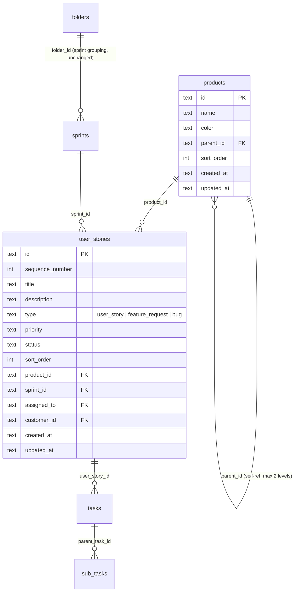

# feat: Products, Issue Types & Sidebar Restructure

## Overview

Introduce multi-product support, issue types on stories, a restructured sidebar with separate Backlogs and Sprints sections, and a quick bug/feature submit widget. This enables tracking work across multiple products while keeping sprints cross-product.

## Problem Statement

The sprint tracker has a flat structure: one backlog, no concept of which product work belongs to, and no way to distinguish bugs from feature requests from user stories. As the user builds multiple products simultaneously, the single backlog is unmanageable and there's no quick way to capture defects. (see origin: docs/brainstorms/2026-04-01-products-issue-types-requirements.md)

## Key Decisions (from origin)

- **Products own backlogs, not sprints** — a sprint pulls work from any product
- **Issue type on Story, not a separate entity** — same table, type field + filter
- **Product = nestable backlog folder** — new `products` table, not extending existing `folders`
- **Settings/Admin to top-right** — frees sidebar for two core sections
- **Logged-in users only** — no public submission forms

## Technical Approach

### Architecture

#### New `products` table

```sql
CREATE TABLE products (
  id TEXT PRIMARY KEY NOT NULL,
  name TEXT NOT NULL,
  color TEXT NOT NULL DEFAULT '#6b7280',
  parent_id TEXT REFERENCES products(id) ON DELETE CASCADE,
  sort_order INTEGER NOT NULL DEFAULT 0,
  created_at TEXT NOT NULL,
  updated_at TEXT NOT NULL
);
CREATE INDEX idx_products_parent ON products(parent_id);
```

- Self-referencing `parentId` for nesting, capped at 2 levels (enforced in application code)
- `color` for visual identification in sidebar and badges
- `ON DELETE CASCADE` — deleting a parent product deletes its children and their stories

#### Schema changes to `userStories`

```sql
ALTER TABLE user_stories ADD COLUMN product_id TEXT REFERENCES products(id) ON DELETE SET NULL;
ALTER TABLE user_stories ADD COLUMN type TEXT NOT NULL DEFAULT 'user_story';
CREATE INDEX idx_stories_product ON user_stories(product_id, status);
CREATE INDEX idx_stories_type ON user_stories(type, status);
```

- `productId` — nullable initially for migration safety, but application code treats it as required for new stories
- `type` — enum: `user_story`, `feature_request`, `bug`. Default `user_story` for backward compatibility

#### Sidebar data model

The sidebar splits into two sections with independent data sources:

1. **Backlogs section**: Query `products` table as a tree (parent/child), with story counts per product
2. **Sprints section**: Existing `folders` + `sprints` queries (unchanged)

Settings and Admin become icons in the header bar (both desktop and mobile).

### ERD



### Implementation Phases

#### Phase 1: Schema & Migration

**Goal**: Add products table, type field on stories, migrate existing data.

**Tasks:**

1. Add `products` table to `src/lib/db/schema.ts`
   - Fields: `id`, `name`, `color`, `parentId` (self-ref FK), `sortOrder`, `createdAt`, `updatedAt`
   - Index on `parentId`

2. Add `productId` and `type` columns to `userStories` in schema
   - `productId`: text, FK to `products.id`, `ON DELETE SET NULL`, nullable
   - `type`: text enum `("user_story", "feature_request", "bug")`, NOT NULL, default `"user_story"`
   - Indexes on `(productId, status)` and `(type, status)`

3. Update shared validators (`src/lib/validators/shared.ts`)
   - Add `storyTypeEnum`: `z.enum(["user_story", "feature_request", "bug"])`

4. Update story validators (`src/lib/validators/story.ts`)
   - Add `type` field (default `"user_story"`) and `productId` field to create/update schemas

5. Generate and run migration
   - `npm run db:generate` then `npm run db:migrate`
   - Migration must: create `products` table, add columns to `user_stories`
   - Seed a "General" default product and assign all existing stories to it via SQL:
     ```sql
     INSERT INTO products (id, name, color, sort_order, created_at, updated_at)
     VALUES ('default-product', 'General', '#6b7280', 0, datetime('now'), datetime('now'));
     UPDATE user_stories SET product_id = 'default-product' WHERE product_id IS NULL;
     UPDATE user_stories SET type = 'user_story' WHERE type IS NULL;
     ```

6. Update `src/lib/types.ts`
   - Add `StoryType` type alias
   - Add icon/colour mapping: `user_story` -> document icon, `feature_request` -> sparkles icon, `bug` -> bug icon

**Files touched:**
- `src/lib/db/schema.ts`
- `src/lib/validators/shared.ts`
- `src/lib/validators/story.ts`
- `src/lib/types.ts`
- `drizzle/` (generated migration)

**Success criteria:**
- [ ] `products` table exists with self-referencing `parentId`
- [ ] `user_stories` has `product_id` and `type` columns
- [ ] Existing stories have `type = 'user_story'` and `product_id = 'default-product'`
- [ ] Build passes, existing functionality unbroken

---

#### Phase 2: Product CRUD & Actions

**Goal**: Server-side actions and API routes for managing products.

**Tasks:**

1. Create `src/lib/validators/product.ts`
   - `productSchema`: name (required, 1-100 chars), colour (hex string), parentId (optional)

2. Create `src/lib/actions/products.ts`
   - `createProduct(db, input)` — validate, generate UUID, enforce max 2-level nesting (check parent's parentId is null), insert
   - `updateProduct(db, id, input)` — validate, update name/colour/parentId
   - `deleteProduct(db, id)` — cascade handled by FK, but manually clean up polymorphic notes/notifications on orphaned stories
   - `getAllProducts(db)` — return flat list ordered by `sortOrder`, caller assembles tree
   - `getProductTree(db)` — return products with `backlogCount` (stories WHERE status='backlog' AND productId=X), assembled as tree structure
   - `reorderProduct(db, id, newSortOrder)` — same midpoint pattern as story reorder

3. Create API routes
   - `src/app/api/products/route.ts` — GET (list all), POST (create). Revalidate `"sidebar"` tag on create
   - `src/app/api/products/[id]/route.ts` — GET, PATCH (update), DELETE. Revalidate `"sidebar"` tag on mutations

**Files touched:**
- `src/lib/validators/product.ts` (new)
- `src/lib/actions/products.ts` (new)
- `src/app/api/products/route.ts` (new)
- `src/app/api/products/[id]/route.ts` (new)

**Success criteria:**
- [ ] Products can be created, renamed, reordered, nested (max 2 levels), and deleted via API
- [ ] Deleting a product cascades to children; orphaned stories get `productId = null`
- [ ] Sidebar cache is revalidated on product mutations

---

#### Phase 3: Story Actions Update

**Goal**: Wire product and type into all story operations.

**Tasks:**

1. Update `src/lib/actions/stories.ts`
   - `createStory`: Accept `productId` and `type` fields. `productId` required for new stories
   - `updateStory`: Allow changing `productId` and `type`
   - `getStories`: Add `productId` and `type` to filter options. Scope sort order queries by `productId`
   - `reorderStory`: Scope re-indexing to stories within the same `productId` (currently re-indexes all backlog stories globally)
   - `moveStoryToSprint` / `moveStoryBackToBacklog`: No changes needed — `productId` stays on the story regardless of sprint assignment
   - `getStories` return type: Include `type` and `productId` in `StoryWithTaskCount`

2. Update story API routes
   - `src/app/api/stories/route.ts`: Accept `productId` and `type` in POST body and GET query params
   - `src/app/api/stories/[id]/route.ts`: Accept `productId` and `type` in PATCH body

3. Update `src/components/features/story-form.tsx`
   - Add `type` field (Select: user_story, feature_request, bug) — default user_story
   - Add `productId` field (Select from products list) — required
   - Accept `allProducts` prop

4. Update `src/components/features/story-card.tsx`
   - Display issue type icon/badge next to sequence number
   - Display product name/colour badge

5. Update `src/components/features/story-detail.tsx`
   - Show type badge and product badge in the header area

**Files touched:**
- `src/lib/actions/stories.ts`
- `src/app/api/stories/route.ts`
- `src/app/api/stories/[id]/route.ts`
- `src/components/features/story-form.tsx`
- `src/components/features/story-card.tsx`
- `src/components/features/story-detail.tsx`

**Success criteria:**
- [ ] Stories can be created with a type and product
- [ ] Backlog queries can filter by product and type
- [ ] Story reorder is scoped to product
- [ ] Type and product badges visible on story cards and detail pages

---

#### Phase 4: Sidebar Restructure

**Goal**: Split sidebar into Backlogs (product tree) and Sprints (folder tree). Relocate Settings/Admin.

**Tasks:**

1. Update `src/app/(dashboard)/layout.tsx` — `getSidebarData()`
   - Add product tree query: `getAllProducts` with backlog counts per product
   - Keep existing folder/sprint queries for the Sprints section
   - Return `productTree`, `allFolders`, `activeSprints`, `completedSprints`

2. Rewrite `SidebarNav` in `src/app/(dashboard)/layout.tsx`
   - **Backlogs section** (top):
     - Section header: "Backlogs"
     - Product tree: each product as a `<details>` item with name, color dot, backlog count
     - Nested products indented under parents
     - Each product links to `/products/[id]/backlog`
     - Inline actions: create product, rename, delete (context menu or icons on hover)
   - **Sprints section** (below backlogs):
     - Section header: "Sprints"
     - Existing folder/sprint tree (unchanged logic, moved to this section)
     - Sprint overview link at `/sprints`
   - **Remove** Settings and Admin links from sidebar

3. Move Settings/Admin to header bar
   - `src/app/(dashboard)/layout.tsx` header area (line ~228): Add Settings gear icon and Admin shield icon next to NotificationBell and UserMenu
   - Both desktop and mobile headers get these icons

4. Update `src/components/features/mobile-sidebar.tsx`
   - Same two-section structure as desktop
   - Settings/Admin icons in mobile header bar (the hamburger/top bar)

5. Update `src/components/features/sidebar-nav-link.tsx`
   - Add `/products` prefix matching for backlog section active state

6. Create new backlog route per product
   - `src/app/(dashboard)/products/[id]/backlog/page.tsx`
   - Server component, fetches stories filtered by `productId`
   - Renders `<BacklogList>` with product-scoped data
   - "Create Story" defaults to this product

7. Update existing `/backlog` route
   - Redirect to `/products/[defaultProductId]/backlog` or show an aggregate "All Products" view
   - Recommended: keep as aggregate view for cross-product visibility, read-only (create/reorder actions happen in product-specific views)

**Files touched:**
- `src/app/(dashboard)/layout.tsx`
- `src/components/features/mobile-sidebar.tsx`
- `src/components/features/sidebar-nav-link.tsx`
- `src/app/(dashboard)/products/[id]/backlog/page.tsx` (new)
- `src/app/(dashboard)/backlog/page.tsx` (update to aggregate or redirect)

**Success criteria:**
- [ ] Sidebar shows Backlogs section with product tree and Sprints section with folder tree
- [ ] Clicking a product navigates to its backlog
- [ ] Settings/Admin accessible via header icons on both desktop and mobile
- [ ] Product backlog page shows only that product's stories
- [ ] Sidebar counts update when stories are added/removed

---

#### Phase 5: Sprint View Updates

**Goal**: Show product context on sprint pages and add product/type filters.

**Tasks:**

1. Update `src/app/(dashboard)/sprints/[id]/page.tsx`
   - Fetch products list for filter dropdown
   - Pass product info to story and task display components
   - Stories section (added in prior work): show product badge on each story row

2. Update `src/components/features/task-list-wrapper.tsx`
   - Add product filter dropdown (similar to existing tag/customer filters)
   - Add issue type filter for stories shown on the sprint page

3. Update story rows on sprint page
   - Show product colour dot + name alongside each story
   - Show issue type icon

**Files touched:**
- `src/app/(dashboard)/sprints/[id]/page.tsx`
- `src/components/features/task-list-wrapper.tsx`

**Success criteria:**
- [ ] Sprint pages show which product each story belongs to
- [ ] Sprint views can be filtered by product and issue type
- [ ] No changes to how tasks/subtasks work within sprints

---

#### Phase 6: Quick Submit Widget

**Goal**: Floating action button for rapid bug/feature capture from any page.

**Tasks:**

1. Create `src/components/features/quick-submit.tsx`
   - Client component
   - Renders a floating action button (bottom-right, `fixed` position, z-50)
   - Icon: `BugIcon` or `PlusIcon` — toggles open a compact popover/dialogue
   - Form fields:
     - Title (text input, required)
     - Type (toggle: bug / feature_request, default bug)
     - Product (Select dropdown from products list)
     - Description (textarea, optional, collapsed by default)
     - Priority (Select, optional, default medium)
   - Submit: POST to `/api/stories` with `{ title, type, productId, description, priority, status: "backlog" }`
   - On success: show brief toast ("Bug reported!" / "Feature requested!"), keep form open with product and type pre-filled, clear title and description
   - On error: show inline error

2. Add `<QuickSubmit>` to dashboard layout
   - `src/app/(dashboard)/layout.tsx`: render inside the main content area, after children
   - Pass products list as prop (already fetched in sidebar data)
   - Only renders for authenticated users (layout already gates on auth)

3. Revalidate sidebar on submit (handled by existing `/api/stories` POST route which calls `revalidateTag("sidebar", "seconds")`)

**Files touched:**
- `src/components/features/quick-submit.tsx` (new)
- `src/app/(dashboard)/layout.tsx`

**Success criteria:**
- [ ] FAB visible on all dashboard pages
- [ ] Bug/feature can be submitted in under 5 seconds (title + type + product + submit)
- [ ] Form stays open after submission for rapid-fire entry
- [ ] Product and type selections persist between submissions
- [ ] New story appears in the correct product backlog

---

#### Phase 7: Notifications & Email

**Goal**: Complete the notification system — trigger notifications on all assignment events across stories, subtasks, and notes. Wire up Resend email delivery.

**Current state** (from research):
- **Working**: Task assignment/reassignment notifications (in-app + email if `RESEND_API_KEY` set), notification bell UI with polling, mark-as-read, deduplication, self-notification suppression
- **Partially built**: React email templates exist (`task-assigned.tsx`, `note-added.tsx`) but aren't used — `send-notification.ts` uses inline HTML instead
- **Missing**: Story assignment notifications, subtask assignment notifications, note-added notifications

**Tasks:**

1. Add story assignment notifications to `src/lib/actions/stories.ts`
   - In `createStory`: if `assignedTo` is set and differs from `createdBy`, call `triggerNotification` with type `"assignment"`, entityType `"story"`
   - In `updateStory`: if `assignedTo` changed, call `triggerNotification` with type `"reassignment"` (or `"assignment"` if previously unassigned), entityType `"story"`

2. Add subtask assignment notifications to `src/lib/actions/subtasks.ts`
   - In `createSubTask`: if `assignedTo` is set and differs from `createdBy`, call `triggerNotification` with type `"assignment"`, entityType `"subtask"`
   - In `updateSubTask`: if `assignedTo` changed, call `triggerNotification` with type `"reassignment"`, entityType `"subtask"`

3. Add note-added notifications to `src/lib/actions/notes.ts`
   - In `createNote`: look up the entity's assignee (story/task/subtask). If the note author differs from the assignee, call `triggerNotification` with type `"note"`
   - This requires resolving the parent entity to find who to notify

4. Switch email sender to use React email templates
   - Update `src/lib/email/send-notification.ts` to render `task-assigned.tsx` and `note-added.tsx` via `@react-email/components` `render()` function instead of inline HTML
   - Create a `story-assigned.tsx` template for story assignments
   - Create a `subtask-assigned.tsx` template for subtask assignments (or reuse task template with entity-aware copy)

5. Set `RESEND_API_KEY` in Vercel production environment
   - Key: `re_S8U7rvnJ_MhZSdBoWxzDcYEgX8dxGcGHJ`
   - Already added to `.env.local` for local dev
   - Also add to `.env.production` for Vercel builds

6. Configure `EMAIL_FROM` with a verified sender domain (or keep `onboarding@resend.dev` for now)

**Files touched:**
- `src/lib/actions/stories.ts`
- `src/lib/actions/subtasks.ts`
- `src/lib/actions/notes.ts`
- `src/lib/email/send-notification.ts`
- `src/lib/email/templates/story-assigned.tsx` (new, or reuse existing)
- `.env.local` (already done)
- `.env.production`

**Success criteria:**
- [ ] Story (re)assignment triggers in-app notification + email
- [ ] Subtask (re)assignment triggers in-app notification + email
- [ ] Note creation notifies the entity's assignee (in-app + email)
- [ ] Emails render using React email templates, not inline HTML
- [ ] Self-notifications suppressed (existing behaviour preserved)
- [ ] `RESEND_API_KEY` set in both local and production environments

---

## System-Wide Impact

### Interaction Graph

- Creating a product -> revalidates `"sidebar"` cache tag -> sidebar re-renders with new product
- Creating a story with `productId` -> revalidates `"sidebar"` -> product backlog count updates
- Moving a story to sprint -> story retains `productId` -> appears in sprint with product badge
- Deleting a product -> CASCADE deletes child products -> stories get `productId = null` (SET NULL) -> stories become orphaned (shown in aggregate backlog)

### State Lifecycle Risks

- **Orphaned stories after product deletion**: Stories get `productId = null` via `ON DELETE SET NULL`. They won't appear in any product backlog. The aggregate backlog view should catch these (show stories with `productId IS NULL` in an "Unassigned" section, mirroring the "Unlinked Tasks" pattern).
- **Sort order isolation**: Story reorder must be scoped to `productId`. If the reorder action doesn't filter by product, dragging in one product's backlog could re-index stories across all products.
- **Migration safety**: The `type` column with a `DEFAULT 'user_story'` ensures all existing rows get a valid type. The `productId` assignment happens in a data migration step after the schema change.

### API Surface Parity

| Endpoint | Change |
|----------|--------|
| `POST /api/stories` | Accept `productId`, `type` |
| `PATCH /api/stories/[id]` | Accept `productId`, `type` |
| `GET /api/stories` | Accept `productId`, `type` query params |
| `POST /api/stories/reorder` | Scope re-index by `productId` |
| `GET /api/products` | New |
| `POST /api/products` | New |
| `PATCH /api/products/[id]` | New |
| `DELETE /api/products/[id]` | New |

## Acceptance Criteria

### Functional Requirements

- [ ] Products table exists with self-referencing nesting (max 2 levels)
- [ ] Stories have `type` (user_story / feature_request / bug) and `productId` fields
- [ ] All existing stories migrated to default "General" product with type `user_story`
- [ ] Sidebar displays two sections: Backlogs (product tree) and Sprints (folder tree)
- [ ] Each product links to its own backlog page at `/products/[id]/backlog`
- [ ] Backlog pages filterable by issue type, assignee, customer
- [ ] Story cards display issue type icon and product badge
- [ ] Settings and Admin accessible via top-right icons (desktop and mobile)
- [ ] Quick submit FAB available on all pages for logged-in users
- [ ] Quick submit creates stories in the correct product backlog
- [ ] Sprint pages show product context on stories and support product/type filters
- [ ] Products can be created, renamed, nested, reordered, and deleted via sidebar
- [ ] Story assignment/reassignment triggers in-app notification + email
- [ ] Subtask assignment/reassignment triggers in-app notification + email
- [ ] Note creation notifies the entity's assignee
- [ ] Emails use React email templates via Resend

### Non-Functional Requirements

- [ ] Sidebar loads within existing 30s cache TTL (no additional queries on every page load)
- [ ] Product backlog page performs comparably to current global backlog
- [ ] Quick submit form submits in < 1 second

### Quality Gates

- [ ] `npx next build` passes with no type errors
- [ ] Existing tests continue to pass
- [ ] Local testing via `npm run dev` with snapshot data

## Dependencies & Prerequisites

- Phase 1 (schema) must complete before all other phases
- Phase 2 (product CRUD) must complete before Phase 4 (sidebar) and Phase 6 (quick submit)
- Phase 3 (story updates) must complete before Phase 4 and Phase 5
- Phases 4, 5, 6, and 7 can be parallelized after their prerequisites
- Phase 7 (notifications) has no dependency on Phases 1-6 — it can run independently or in parallel

## Risk Analysis & Mitigation

| Risk | Impact | Mitigation |
|------|--------|------------|
| SQLite table rebuild required for adding columns | Migration complexity | Use Drizzle's generated migration which handles the PRAGMA foreign_keys / rebuild pattern |
| Sidebar becomes cluttered with many products | UX degradation | Cap nesting at 2 levels; collapsible product sections |
| Sort order bugs when scoping reorder to product | Stories appear in wrong order | Unit test reorder with product-scoped filtering |
| Orphaned stories after product deletion | Stories disappear from all backlogs | Show "Unassigned" section in aggregate backlog for stories with `productId = null` |

## Issue Type Icon Mapping

| Type | Icon | Colour | Badge Label |
|------|------|-------|-------------|
| `user_story` | `BookOpenIcon` | grey-400 | Story |
| `feature_request` | `SparklesIcon` | purple-400 | Feature |
| `bug` | `BugIcon` | red-400 | Bug |

## Migration Strategy

1. Run `drizzle-kit generate` to produce the schema migration
2. Manually append data migration SQL to seed default product and backfill existing stories
3. Test locally: `npm run db:snapshot` (get fresh prod data) -> apply migration -> verify
4. Deploy to Vercel: Drizzle runs migration on first request

## Sources & References

### Origin

- **Origin document:** [docs/brainstorms/2026-04-01-products-issue-types-requirements.md](docs/brainstorms/2026-04-01-products-issue-types-requirements.md) — Key decisions: products own backlogs not sprints, issue type as Story field, product = nestable backlog folder, settings/admin to top-right

### Internal References

- Database schema: `src/lib/db/schema.ts`
- Existing folder CRUD pattern: `src/lib/actions/folders.ts`, `src/components/features/sprint-folder-list.tsx`
- Story actions: `src/lib/actions/stories.ts`
- Sidebar layout: `src/app/(dashboard)/layout.tsx:20-191`
- Story form: `src/components/features/story-form.tsx`
- Backlog page: `src/app/(dashboard)/backlog/page.tsx`
- Story card: `src/components/features/story-card.tsx`
- Cache pattern: `unstable_cache` with `"sidebar"` tag, `revalidateTag("sidebar", "seconds")`
- Drag-drop pattern: `@dnd-kit/react` with `useSortable` + `useDroppable` + `move()` helper
